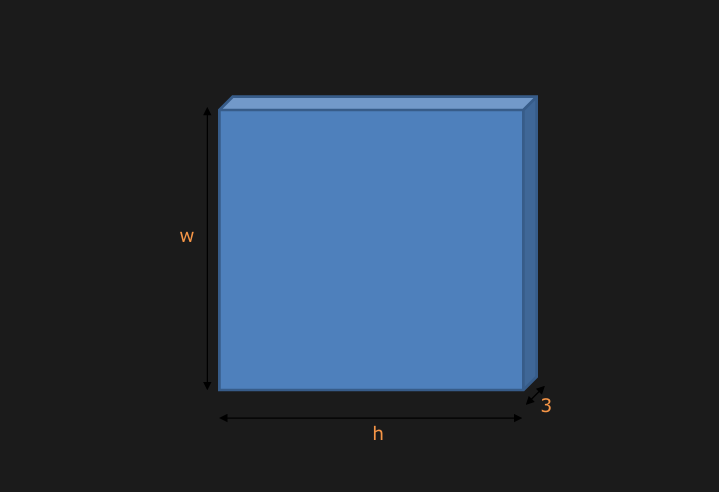
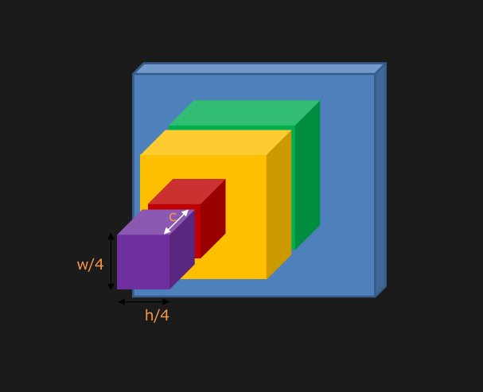
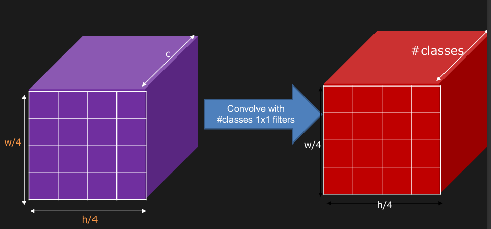
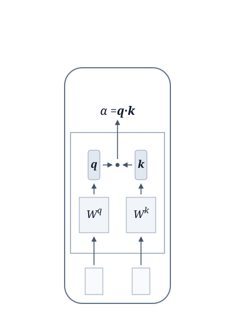

# Info From CSE 164 Lecture Notes
A lot of the information needed to finish this project was covered as part of course material. This 

Self and Semi supervised learning are likely key to  were both discussed heavily in class! Recapping lecture notes:

## Self-Training
Follows the assumption that the decision boundary lies in an area of low density. The order of operations for self-training is as follows:
1. train model f* from labeled data
2. apply model f* to unlabeled data set
3. remove a set of data from unlabeled data set, add them into labeled data set
### Hard Label vs Soft Label
**Soft labels fail in self-training!** Hard labels are basically what happens when you take the continuous softmax distribution output from the model, and turn it into discrete, one-hot vector from argmax. Basically the process to get the top-1 result. *(e.g. given classes [Dog, Cat, Bird], and softmax output [0.7, 0.2, 0.1], the soft label is [0.7, 0.2, 0.1], and the hard label is [1.0, 0, 0]. Otherwise, label is "Dog")*
### Entropy-Based Regularization
Term based on **Shannon Entropy** of model output distribution.

**Shannon Entropy:**
$$
H(p)=-\sum_i p_i \ln p_i
$$
This basically evaluates how conncentrated the distribution of the unlabeled prediction is. \
This means that:
- If one prediction is highly favored: [1, 0, 0, 0, 0], then entropy is **smaller.**
- If prediction is spread out: [0.2, 0.2, 0.2, 0.2, 0.2], then entropy is **bigger**
For an unlabeled datapoint to be more relavant, we're looking for entropy as small as possible.

**Shannon Entropy** is included into the loss calculation by the folllowing formula:
$$
L=\sum_{x^r}C(y^r, \hat{y}^r) \pm \lambda \sum_{x^u}H(y^u)
$$
In simple terms, this is the just:
- **task loss:** this is the regular loss from the task at hand *(Most likely cross-entropy)*. 
    - This is the part that comes from **BOTH** ground truth labels **AND** pseudolabels. 
    - This is the $L=\sum_{x^r}C(y^r, \hat{y}^r)$ portion. 
    - Class lecture slides call this **labeled data**.
- **entropy factor:** this is a weighted entropy term.
    - $\lambda$ is a hyperparameter that determines the entropy penalty.
        - If $\lambda$ is too high, model will become overconfident on wrong predictions, and there will be confirmation bias
        - If $\lambda$ is too low, entropy penalty ignored, learning only happens on small pool of labeled data
    - $H(y^u)$ is the **Shannon Entropy** (also $H(p)$) discussed above.

## Segmentation
**Semantic Segmentation:** classify EVERY PIXEL in an image
### Evaluation Metrics - IoU
**IoU:** stands for **Intersection over Union** - the area of overlap between the predicted segmentation and the ground truth, **divided by** the area of union between the predicted segmentation and the ground truth.
### Classification to Segmentation
Classification task works in the following structure *(for CNN)*:
```
Input -> Convolutional Layers -> Output Vector -> Softmax -> Output Label (argmax)
```
This is an example of **end-to-end learning:** the entire pipeline is trained simultaneously. Error from classification output is backpropogated through entire network to update weights - single process.

This is where the issue arises: this network squashes down to a num-classes long vector. How to turn this into a **dense** map for **EVERY pixel**?

First step is that the last fully connected layers should be removed. This is done for the following reasons:
1. **Prevent Spatial Collapse:** the fully connected network squashes the 2D feature maps into 1D vector. The spatial coordinates are needed to be kept in order to produce the final pixel-by-pixel feature map.
2. **Removing Fixed Input Constraints:** Fully connected networks require a strictly defined number of input nodes. This is why classification CNNs need resizing before inference. Convolution & pooling layers just move filters across input, do not care about absolute size of image. Removing fully connected layers -> the model turns into a **Fully Convolutional Network (FCN).** This can take arbitrary dimension images, output corresponding feature map.

So, the reconstructed/segmentation pipeline becomes the following:
1. **Start with the input tensor:** for RGB images, this means a **W x H x 3** tensor. 3 channels for R, G, B, and W x H for the arbitrary image size.\

2. **Encoder/Subsampling:** Pass through successive convolutional and pooling layers. Just like any CNN, until getting to a final feature map.\
  
In this case, subsampling takes the 2D feature map into a quarter of the original size *(w/4 x h/4)*, and has a feature depth of c channels. Because the fully connected layers were removed, spatial information gets preserved. Each "cell" in the grid contains a c-dimensional vector with the rich semantic features extracted from the respective field in the og image.
3. **Deep Feature Map:** at this part passes N 1 x 1 convolution over the entire purple tensor, where N is the number of classes. This maps features to classes.\
 
The tensor at the end of the encoding stage *(purple one)* had a feature depth of c arbitrary channels. The 1x1 convolution over the entire tensor turns into the first decoding tensor *(the red one)*, which has a feature depth equal to the number of classes. This lets us map the individual features into classes.

Then: scores are gotten for the subsampled image, making the red block a coarse segmentation map. Then, the resulting tensor is upscaled back to the original size, giving the true dense pixel-by-pixel segmentation mask.

### Reconstruction!
Reconstructing is the difficult part, so like do that.
#### Addressing faulty logics:
Reconstructing from a low-resolution blog is hard. **So why not just make the encoder shallower?** If deep networks and more layers destroy fine details, why not use a shallow network and pull predictions early?

**Heck no:** deeper networks work better because they capture more abstract concepts. Shallow networks are not very semantic.

What about removing subsampling? Subsampling squashes the resolution (pooling and downsampling).

**Heck no:** A convolutional filter is very small. If the network is never shrunk, the network only looks at a small localized patch. This prevents the network from understanding higher-level semantic features. Subsampling increases the "field of view" of the entire network, allowing it to understand higher level concepts.\
For example: picture this. Playing Minecraft with 500% FOV the whole time. You can't tell what's what, you're literally looking at like one single block in your entire screen. However when you zoom out, you're able to see larger things like trees, houses, and you can tell that you're in a plains village.

Further, there's the issue of memory and speed, downsampling lets the smaller H, W be computationally feasible.

So, we need to use **upsampling!**

#### Upsampling
E.g. going from a tensor (w/4, h/4, num_classes) to (w/2, h/2, num_classes)

**Options:**
- **Bed of Nails**
<div style="display: flex; align-items: center; gap: 20px;">

<div>
  <table border="1">
    <tr><td>1</td><td>2</td></tr>
    <tr><td>3</td><td>4</td></tr>
  </table>
  <b>Input</b><br>C x 2 x 2
</div>

<div>→</div>

<div>
  <table border="1">
    <tr><td>1</td><td>0</td><td>2</td><td>0</td></tr>
    <tr><td>0</td><td>0</td><td>0</td><td>0</td></tr>
    <tr><td>3</td><td>0</td><td>4</td><td>0</td></tr>
    <tr><td>0</td><td>0</td><td>0</td><td>0</td></tr>
  </table>
  <b>Output</b><br>C x 4 x 4
</div>

</div>

- **Nearest Neighbor**
<div style="display: flex; align-items: center; gap: 20px;">

<div>
  <b>Input</b><br>C x 2 x 2
  <table border="1">
    <tr><td>1</td><td>2</td></tr>
    <tr><td>3</td><td>4</td></tr>
  </table>
</div>

<div>→</div>

<div>
  <b>Output</b><br>C x 4 x 4
  <table border="1">
    <tr><td>1</td><td>1</td><td>2</td><td>2</td></tr>
    <tr><td>1</td><td>1</td><td>2</td><td>2</td></tr>
    <tr><td>3</td><td>3</td><td>4</td><td>4</td></tr>
    <tr><td>3</td><td>3</td><td>4</td><td>4</td></tr>
  </table>
</div>

</div>

- **Bilinear Interpolation**
<div style="display: flex; align-items: center; gap: 20px;">

<div>
  <table border="1">
    <tr><td>1</td><td>2</td></tr>
    <tr><td>3</td><td>4</td></tr>
  </table>
  <b>Input</b><br>C x 2 x 2
</div>

<div>→</div>

<div>
  <table border="1">
    <tr><td>1.0</td><td>1.2</td><td>1.7</td><td>2.0</td></tr>
    <tr><td>1.5</td><td>1.7</td><td>2.2</td><td>2.5</td></tr>
    <tr><td>2.5</td><td>2.7</td><td>3.2</td><td>3.5</td></tr>
    <tr><td>3.0</td><td>3.2</td><td>3.7</td><td>4.0</td></tr>
  </table>
  <b>Output</b><br>C x 4 x 4
</div>

</div>

However, we have something even better:

### Learnable Upsampling! + U-Net
A standard convolution maps a patch of input pixels to a single output pixel. This is like information compressing/feature-extracting. However, a transposed convolution (e.g. using stride=2),  and using zero-insertion (inserting empty space/zeros), this creates a larger output than the original input.

This creates a **Fully Convolutional Network (FCN)**, where details are added back in from the low-resolution blob using fractional striding and other upsampling techniques techniques.

#### U-Net
This is how U-Net is made! Instead of a long, straight line of processing, U-Net is completely symmetric. It goes Encoder (downsampling + semantic extraction) -> Decoder (upsampling + per-pixel labeling). It's called U-Net because exact same on both sides.

**But Limitation:** it's very hard to recover edge details. **SOLUTION: Directly fuse info from low layers to high layers!!**

#### Skip Connections
Because U-Net is symmetric on both sides, the feature maps will have the same dimensions on both sides. It takes feature maps from the encoder stage, and uses them to help reconstruct the image with sharp resolution.

As the decoder attempts to rebuild the image, the following steps happen at each layer:
1. The layer first **upscales** the image, using one of the upscaling techniques discussed above.
    - *Note that the original paper uses up-convolution as discussed above, however there is the issue of checkerboard artifacting. For most modern intents and purposes, bilinear interpolation is used.*
2. The layer the looks for the **corresponding encoder layer** and takes the feature map **after convolutions and ReLU, before max-pooling**
    - *Why after convolutions? Because the feature map should be as processed and feature-rich as possible for that resolution size. Note that this follows from the original ReLU paper here: https://arxiv.org/pdf/1505.04597*
3. The layer then **concatenates** the corresponding feature map
    - *Concatenation means literally stacking the tensors along the channel (depth) axis, becoming $H\times W \times (C_{decoder} + C_{encoder})$. In practice with U-Net, this means that the tensor becomes doubly deep, as the mirrored encoder-decoder structure means that the tensors have the same size on both sides.*
4. After concatenation, the decoder layer runs **the mirrored encoder convolution layer**.

## Object Detection
*skip for now, not needed this project*

## Attention & Transformers
**Attention is all you need!**

Recapping from CNNs, they function on three primary assumptions:
1. Some patterns are much smaller than others.\
    *For example, a cat's eye or a cat's ear are much smaller than a cat*
2. The same pattern can appear in different regions.\
    *Cats have two eyes, and two ears. If there are multiple cats in a photo, there will be several cat eyes and ears in different places all across the photo (translation invariance.)*
3. Subsampling the pixels will not change the object.\
    *A cat is still identifiable as a cat even if the image resolution is reduced.*

**But now, getting into transformers!!!**

**arxiv.org/abs/1706.0376 - the paper that changed EVERYTHING**

Simply, transformers can be made up of:
- **Inputs:** a sequence of tokens/image patches enter the network, and go into
- **Self Attention Layer:** instead of processing data sequentially, self-attention makes the network look at the entire input sequence at once, and calculates how important each element is relative to others. Calculates weighted average of values between similarity between **queries** and **keys.**
- **Fully Connected Layers:** aka position-wise feed-forward networks, they are applied independently to each position's representation - further transformation.

### Attention in Depth
#### So, What is Attention?
Take an **input sequence** $a^1, a^2, a^2, a^4$ - these represent the initial data sequence entering the attention layer. These can be word tokens, or in the case of image processing, flattened image patches.

This **input sequence** produces a **target output** $b^1$.

How does the **input sequence** produce a **target output**? By the relevance calculation: $\alpha$.

What is the calculation though? Putting it simply, $b^1$ is the attempt to get a **context-aware** version of $a^1$. As an example: consider the word **"turkey"**. 
- Let $a^1$ be the word **"turkey"**
- Let $a^2$ = "is"\
    &ensp; &ensp; $a^3$ = "very"\
    &ensp; &ensp; $a^4$ = "yummy"
- The full sequence becomes:\
    $(a^1, a^2, a^3, a^4)=$ *"**turkey** is very yummy"*
- Then $b^1$ is the word **"turkey"** *in the context* of the sequence *"**turkey** is very yummy"*.

In this case, it's easy for a human brain to assume that **"turkey"** is referring to the **food**, not the **country**. But how do we know that? **By the context.** 

Think about what words key you into this clue. *"is"* and *"very"* allow the sequence to follow important syntax rules, but they aren't very revealing to what the *meaning* of **"turkey"** is in this sequence.

But consider the word **"yummy"**. It doesn't make very much sense to place *"an adjective used to describe food that tastes extremely good or delicious"* as a descriptor of a country. Our human brains instantly pick up on that, and infer the meaning of **"turkey"** relative to the sequence.

Regardless of *how* to get to the point of knowing **"yummy"** means food, the important thing to note is *how much each word in the sequence corresponds to the meaning of **"turkey"***.

Looking back to the transformer, each $a$ in the sequence has a corresponding $\alpha$. From the sequence $(a^1, a^2, a^3, a^4)=$ *"**turkey** is very yummy"*, we found above that **"yummy"** was the biggest factor in determining that **"turkey"** has to do with food, while *"is"* and *"very"* don't really matter much.

In response - it makes sense that $\alpha$ should be **lower** for *"is"* and *"very"*, while it should be **higher** for **"yummy"**.

This is the fundamental intuition of **how attention works.**

#### Query, Key - The Guts of Self Attention
The mechanism of how self-attention works is through **queries** and **keys**.

*side note: while taking CSE 40, CSE 142, CSE 144, this NEVER made sense to me. Today is the day!!!*

How self attention operates is fundamentally based on **vector multiplications.**
<div style="display: flex; align-items: center;">
     
</div>

Ok, what's happening here? Let's break it down:
1. **Inputs go in!** These are the individual patches/tokens/elements of the sequence.
    - **Format:** these are 1D vectors of numbers with a fixed size, a parameter often called $d_{\text{model}}$
    - If in the first layer of self-attention, these are **raw embeddings**
    - If in later layers, these individual elements have **context from the previous layer** attached to them!
2. **Multiply to Weight Matrices.** Each element gets multiplied by two weight matrices, $W^q$ and $W^k$.
    - $W^q$ is the query matrix and $W^k$ is the key matrix.
    - Both are 2D matrices that hold the layer's **learned weights.**
    - Each self attention layer has it's own $W^q$ and $W^k$ matrices! This lets the layer look for specific patterns at that depth. *Think back to CNNs, each subsequent layer finds different patterns!*
    - The size of $W^q$ and $W^k$ are $d_q \times d_{\text{model}}$ and $d_k \times d_{\text{model}}$ respectively. These are all determined hyperparameters!
3. **Queries $q$ and $k$ get created!** The mulitiplication creates **query** and **key** vectors.
    - Multiplying input vector by $W^q$ creates a **query vector:** $\boldsymbol{q}=\boldsymbol{a^i}W^q$. This is like asking a specific question about the context *(what adjectives around me describe food?)*
    - Multiplying a different input vector by $W^k$ creates a **key vector:** $\boldsymbol{k}=\boldsymbol{a^j}W^k$. This is like putting a label onto the element *(this is an adjective describing food)*
4. **How Relevant Are You?** The actual attention score - $\alpha$ is found!
    - The **attention score**, $\alpha$, is calculated using dot product - $\alpha = \boldsymbol{q} \cdot \boldsymbol{k}$
    - Recall - dot product measures **how aligned** two vectors are. In this situation, it represents how closely the "question" $\boldsymbol{q}$ matches the "label" $\boldsymbol{k}$. This is how we get $\alpha$!

This happens for **every single pair:**

*TODO: continue rest later*

#### The Embedding Matrix (More on Raw Embeddings)
Input gets tokenized, then gets looked up in the **Embedding Matrix**

*TODO: rest of this is lowkey out of scope for this*

### Transformers for Vision
#### Patchify
*TODO - tldr pixels too computationally expensive, need to patch*

#### Permutation Invariance
*TODO - tldr transformers can handle different order elements*

#### Positional Encoding
*TODO - tldr transformers don't encode position*

## Data Augmentations
*lowkey not much on slides*

