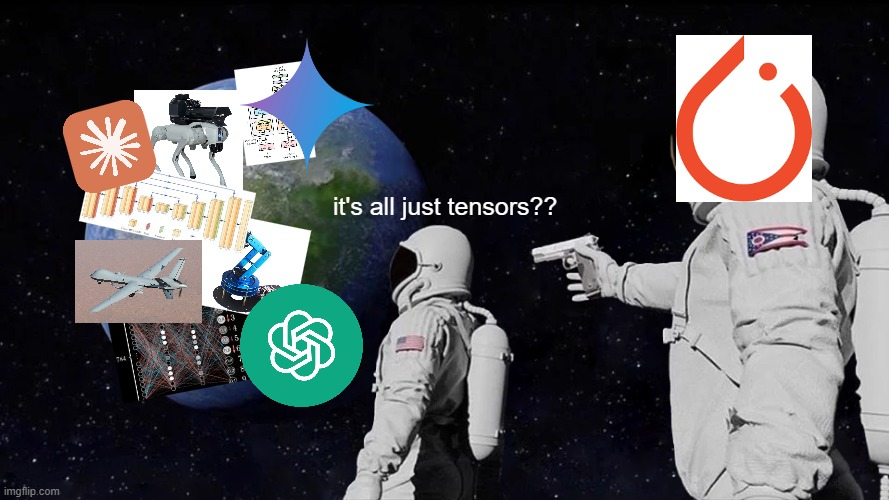

# Time To Cook
## Lecture Note Insights - Brainstorm!
- Entropy Based Regularization looks very very promising! 
    - I know that classifier will be somewhat straightforward to do
    - I wonder if semantic segmenter would also be possible with entropy-based regularization?
- I FINALLY GET HOW ENCODERS/DECODERS WORK RAHHHH
    - ITS ALL TENSORS
    
    - ALL THE WAY DOWN
    - U-NET MAKES SO MUCH SENSE
    - RAHHHHHHH
- I GET HOW LLMS WORK OMG
    - after ALL THESE YEARS
    - attention finally makes sense
- Data Augmentations
    - augmenting data can maybe get me even further!!
    - dataset is still relatively small, even with unlabeled samples
    - evaluate performance as is first, then maybe augment data for even more samples
- ... bruh...
why is it so hard to get sparse convolutions... PAIN
- Let's see if Docker works right!!
- Ok, now the other way...?
    - OKAYYYYYY